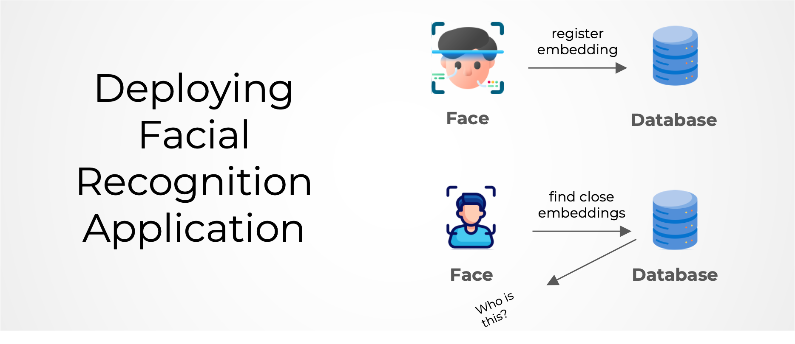

# Facial Recognition Deployment with PostgreSQL and `pgvector`



This repository contains code for deploying a FastAPI application that utilizes PostgreSQL as its database backend, with support for the pgvector extension for facial recognition. It includes functionality for extracting and saving facial embeddings to PostgreSQL, as well as comparing new embeddings to find the closest facial embeddings.

### Containerization and Persistent Storage

The application is containerized using Docker, enabling easy deployment and scalability. Docker volumes are utilized to provide persistent storage, ensuring that data is retained even if containers are restarted or recreated. Additionally, the containers are connected via a Docker network, facilitating seamless communication between different components of the deployed application.

## Description

The FastAPI application provides endpoints for various functionalities, including:

- Interaction with a PostgreSQL database.
- Integration with the pgvector extension for vector-based operations.
- Serving API endpoints for your application.

## Deploying with Docker Compose

Before running the application, ensure you have the following installed:

- Docker: [Installation Guide](https://docs.docker.com/get-docker/)
- Docker Compose: [Installation Guide](https://docs.docker.com/compose/install/)


1. Clone the repository:

```bash
git clone https://github.com/anas-rz/facial-recognition-deployment.git
cd facial-recognition-deployment

```

2. Build and start the Docker containers:

```bash
docker compose up -d
```

##  Deploy with Kubernetes on GKE
1. Build the Docker Image

`docker build -t gcr.io/[project]/image_name . `
-   Replace [project] with your Google Cloud project ID.
-   Replace image_name with the desired name for your image.
2. Push the Image to Google Container Registry (GCR)

`docker push gcr.io/[project]/image_name`

3. Apply YAML Files

```
kubectl apply -f fastapi-deployment.yaml
kubectl apply -f fastapi-service.yaml
kubectl apply -f postgres-deployment.yaml
kubectl apply -f postgres-pvc.yaml
kubectl apply -f postgres-service.yaml 
```

## Usage
- Use the provided API endpoints to interact with the application.

    - For registering faces:
    
    ```bash
    for file in images/input_embeddings/*; do
        curl -X POST -F "file=@$file" -F "name=$(basename $file)" http://localhost:8000/embeddings
    done
    ```
    
    - For comparing faces:
    
    ```bash
    curl -X POST -F "file=@images/test/shahid_test.jpeg" http://localhost:8000/embeddings/closest
    ```
    
    Make sure to replace `images/test/shahid_test.jpeg` with the path to the image you want to compare.

- Modify the FastAPI application code in main.py to add custom functionality as needed.
- Update the Docker Compose file (docker-compose.yml) to configure additional services or settings.
## License
This project is licensed under the MIT License.

## Acknowledgements
FastAPI: [FastAPI](https://fastapi.tiangolo.com/) framework documentation.

pgvector: [pgvector](https://github.com/ankane/pgvector) extension for PostgreSQL.

psycopg2: [psycopg2](https://github.com/psycopg/psycopg2) PostgreSQL adapter for Python.

Docker: [Docker](https://www.docker.com/) Containerization platform.

DeepFace: [DeepFace](https://github.com/serengil/deepface) library for facial analysis.

